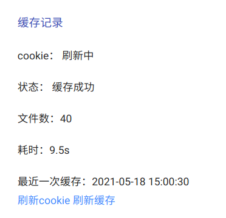

### 注意事项
- 后台配置地址：`http://ip:port/?admin`
- 默认密码：`PanIndex`
- 第一次安装后需要进行配置， 请务必修改默认密码
- 部分配置需要重启生效
- 环境变量的优先级最高！绑定账号后会自动刷新COOKIE和目录缓存，速度快慢取决于你服务器的网络以及你的文件数量
- 可以通过缓存记录查看缓存结果，如果失败，也可以手动同步
> 请不要频繁刷新以免出现验证登录


- 默认关闭目录缓存定时任务，如有需要请自行设置，heroku每天至少执行一次任务，建议`corn：0 0 4 1/1 * ?`


- Heroku：后台配置好后，获取配置json，并复制到heroku新的环境变量`PAN_INDEX_CONFIG`中，端口号会根据环境变量`PORT`覆盖，无需关注

### 基础配置
* 绑定Host：默认`0.0.0.0`，修改后重启生效
* 绑定端口：默认`5238`，修改后重启生效
* 网站标题：默认为空，设置后将优先于网盘名称展示
* 主题： mdui主题功能最全，也会长期更新，并且移动端友好
    * mdui（源自[JustList](https://github.com/txperl/JustList)）（跟随系统切换暗黑、明亮）
    * mdui-light（明亮模式）
    * mdui-dark（暗黑模式）
    * classic（经典主题，不支持账号前端切换及搜索，适用于单账号）
    * bootstrap
    * materialdesign
* 首页账号切换
    * 默认账号：首页将显示默认账号，或顺序第一位的账号，`home`按钮切换
    * 全部账号：首页将以文件夹形式列出所有账号，`home`按钮依然可以切换
* 后台登录密码：默认`PanIndex`，注意保护隐私
* 接口 token：第一次安装时系统随机生成，注意保护隐私
* 密码文件（夹）：格式`id1:pwd1,path1:pwd2`
* 隐藏文件ID（路径）:id1,path1
* 防盗链：允许的 Referrer，多个逗号分隔，例：`baidu.com,google.com`
* 自定义网站图标链接
    * 可以将自定义图标`favicon.ico`上传至网盘，填入图片直链
* 自定义底部信息

```html
©2021 <a href="https://github.com/libsgh" target="_blank">libsgh</a>. All rights reserved.
```
* 底部查看完整配置，用于那些沙盒容器平台配置环境变量

### 账号绑定
- 显示名称：会修改网页标题，每个账号可不一致
- 网盘模式
    - Native： 本地模式，服务器某一目录的文件列表，因为实时获取所以无需更新cookie和目录缓存
    - Cloud189：天翼云网盘
    - Teambition：阿里teambition盘，包括个人网盘和项目文件，依据根目录ID设定自动判断
    - Teambition国际版：阿里teambition国际盘，目前只有项目文件，目录ID为项目ID
    - Aliyundrive：阿里云盘，需要填入有效的`refresh_token`，在[此处登录](https://passport.aliyundrive.com/mini_login.htm?lang=zh_cn&appName=aliyun_drive&appEntrance=web)后抓包获取，
        如果一种登录方式不成功，请尝试扫码等其他方式。[详细教程](https://blog.deepfal.cn/index.php/archives/890)
    - OneDrive：微软云盘，用户填写`client_id`，密码填写`client_secret`，重定向地址`redirect_uri`及最重要的刷新令牌`refresh_token`
        - [在线工具](https://mgaa.noki.workers.dev/)
        - 创建应用
        - 获取onedrive api权限
    由于阿里云的`refresh_token`和`access_token`有效期为2小时，第一次填入后，系统会定时刷新，所以`refresh_token`会更新，但是可以保持始终有效。
- 用户名：部分模式必需，一般是手机号或邮箱
- 密码
- 根目录ID(路径)：native为绝对路径，teambition为项目ID，其他为目录ID，[如何获取？](https://libsgh.github.io/PanIndex/#/question?id=%e5%a6%82%e4%bd%95%e8%8e%b7%e5%8f%96%e7%9b%ae%e5%bd%95id%ef%bc%9f)
> 这里填写你要分享的目录ID，如果你想分享网盘的根目录，天翼云为`-11`，阿里云盘为`root`

### 文件上传
* 手动上传
    * 支持多文件上传，远程目录请填写网盘的相对路径，例如：
        我想上传1这个目录，就填写/1
    
    * 请不要上传太大的文件，一来会占用服务器带宽，二来速度不如从官网进行上传
    * 可以只刷新缓存而不上传文件，这里也可以用来刷新你更改的目录，而不是全量更新所有文件，当你网盘文件很多的时候，这是非常有用的，可以提高缓存的效率。
* 自动同步（待实现）

### 环境变量

环境变量主要用于docker（docker）部署场景，vps下无需关注。另外，环境变量优先级最高。

| 变量名称            | 变量值     | 描述                                                     |
| ------------------- | ---------- | -------------------------------------------------------- |
| PAN_INDEX_CONFIG    | -          | 完整配置文件，可从后台获取                               |
| PAN_INDEX_DEBUG     | true/false | 是否开启调试模式，debug模式将输出更多日志，方便问题追踪  |
| PAN_INDEX_DATA_PATH | /opt/data  | 数据目录，默认与程序同级`data`目录下                     |
| PORT                | -          | 启动端口号，由于Heroku端口号随机，并需要从此环境变量获取 |

