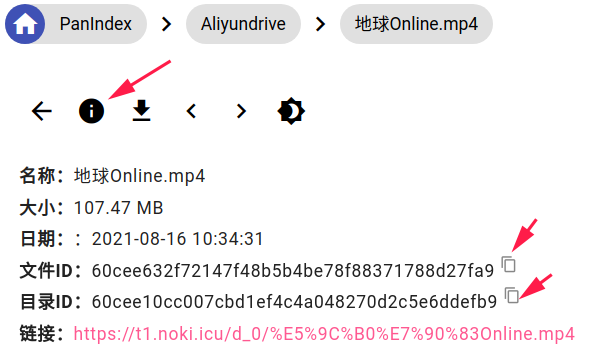

### 忘记后台登录账号、密码如何解决？
> 完整命令示例：
> `/usr/local/bin/PanIndex -c=/usr/local/etc/PanIndex/config.json -reset_password=1234 -reset_user=admin`，命令与你的启动方式有关（配置加载），修改后按原来的方式重新启动
1. 重置用户名、密码，执行命令：`-reset_password=1234`、`-reset_user=admin`
2. **查看用户名、密码**，执行命令：`-cq=admin_password`、`-cq=admin_user`
3. 数据库查看：下载data目录下的数据库文件到本地，使用[SQLite](https://sqlitebrowser.org/dl/)客户端工具查看数据库，在`config_item`表中找到K为`admin_user`，`admin_password`的V值

**推荐方式2**

### 如何获取目录ID？

#### 官方网盘中获取
正常访问官方网盘页面，进入到你想挂载目录的页面，浏览器里地址栏最后面的就是目录ID

- 本地模式：

  服务器目录的绝对路径，例如`/opt`

- 天翼云盘（根目录ID为-11）：

  

- teambition项目盘：

  请使用**项目id**

  

- 阿里云盘（根目录ID为root）：

  

- 和彩云盘（根目录ID为`00019700101000000001`）

- OneDrive（根目录ID为`/`）：

  同本地模式一样，这里的ID为文件路径
- GoogleDrive（根目录ID为`root`）：

  
- S3（根目录ID为**空**）：

  目录ID以`/`结尾，例如`test/abc/`，**请勿添加`/`前缀**

#### PanIndex中获取

  通常，挂载网盘后，需要隐藏某些文件，或为某些目录添加密码，我们可以直接访问文件的预览页查看文件详情，复制文件ID或是父目录ID
  

### PanIndex为何不使用前后端分离？
PanIndex的设计初衷是简单高效，前后分离会增加部署的复杂度，且会增加页面响应时间，PanIndex为单页面应用，目前页面的管理也相对容易，也为了更方便的适配heroku，目前将html，js，css，image都打包到二进制文件中，所以通常你只需要一个二进制文件加一个配置文件即可。
PanIndex未来会逐步完善接口，使之可以单独作为接口使用。

### 如何自定义页面？
参考[自定义主题](/ui.md)

### 登录失效、目录不更新该如何解决？
- 程序启动时会刷新COOKIE（令牌）
- 程序自动检测COOKIE（令牌）的有效性，失效自动刷新
- 如果网盘文件经常更新，可以开启定时缓存任务。
- 计划任务：cron表达式，[cron在线生成](https://cron.qqe2.com/)

如果你更新了网盘文件想要立刻生效，可以手动刷新目录缓存

### 网盘目录空白、文件重叠

- 由于PanIndex使用了SQLite来做数据存储，Heroku会定期清理本地文件，请每天至少执行一次同步缓存的任务，时间可以设置为cookie刷新之后，且尽量选择闲时来同步

- 文件重叠或是目录空白也有可能是缓存中断导致，这种情况可以在网盘挂载配置那里，修改网盘，对应的文件信息会删除重新缓存。

### 缓存失败

用户名，密码，根目录ID填写错误都可能导致缓存失败，请仔细检查

### 天翼云出现验证码登录，如何解决？
2.x关闭了打码狗的使用，若出现验证登录，请等一小时后再尝试。
开发调试：注释掉程序启动刷新COOKIE的代码

### 网盘使用经验

1. 天翼云网盘：普通版容量较小，15G空间，如果文件被多个不同ip访问下载，有一定几率触发限速，会员也无法幸免。天翼云网盘对下载接口的访问做了限制，当频繁获取下载地址时，大概率获取失败。
2. teambition-项目盘：个人测试速度限制在500K左右，不过容量暂时没有限制，也不需要内测资格即可使用，国际服会比国内速度稍快，缺点是上传慢。
3. ~~teambition-个人盘：已关闭~~。
4. 本地磁盘：缺点是下载会占用服务器的带宽，而且服务器到期可能要面临文件的转移，优点是不需要缓存，不用担心账号问题。
5. 阿里云盘：内测+teambition合并有3T，公测使用各种福利码可以达到8T，不过空间可能会回收，不确定是不是永久，阿里云一直都很套路，你懂得，据网友反馈，使用目录程序分享账号可能会ban，管控上比teambition更严格。
6. Onedrive国际版：不错的访问速度，客户端同步方便，api稳定（只要账号不翻车）