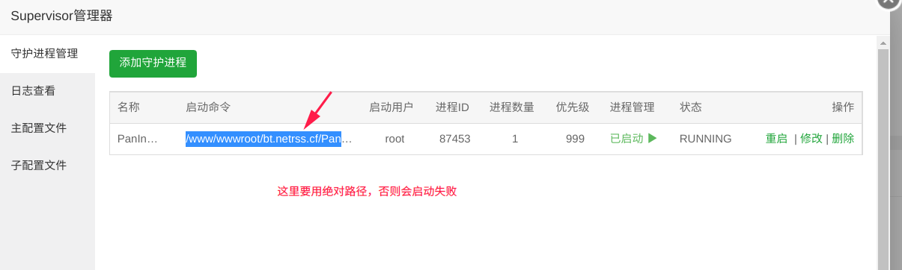

# 快速开始
## 平台支持
由于PanIndex交叉编译需要cgo（sqlite），目前很多平台还不能很好的支持，如果你有特殊的编译需求，请告知我，我会尽量添加
- Linux （x86 / amd64 / arm / arm64 ）
- Windows 7 及之后版本（x86 / amd64 ）
- macos（amd64）

## 下载
预编译的二进制文件压缩包可在 [Github Release](https://github.com/libsgh/PanIndex/releases "release")下载，解压后方可使用。

## 安装

### Bash脚本
- 基于`systemd`的安装脚本，以`root`账户运行
- 脚本仓库：https://github.com/libsgh/PanIndex-install
```bash
$ bash <(curl -L https://github.com/libsgh/PanIndex-install/raw/main/install-release.sh) -h
```

### 直接运行
启动参数<br>
-host=0.0.0.0 #绑定host，默认0.0.0.0<br>
-port=5238 #绑定端口号，默认5238<br>
-debug=false #调试模式，默认false<br>
-data_path=/path/to/data #数据目录（配置、目录信息、临时文件目录）<br>
-cert_file=/path/to/fullchain.pem # 开启ssl，证书文件<br>
-key_file=/path/to/privkey.pem # 开启ssl，证书文件密钥<br>
-cq=port # 只是查询配置，程序并不会启动
```bash
$ tar -xvf PanIndex-v1.0.0-linux-amd64.tar.gz
#nohup ./PanIndex -host=0.0.0.0 -port=5238 -debug=false > PanIndex.log &
#./PanIndex -cq port
$ nohup ./PanIndex > PanIndex.log &
```
### 在Systemd下运行
> 以下命令请切换到root下执行

1. 下载PanIndex并解压
```bash
$ mkdir /usr/local/etc/PanIndex
$ cd /usr/local/etc/PanIndex
$ wget https://github.com/libsgh/PanIndex/releases/download/v2.0.3/PanIndex-v2.0.3-linux-amd64.tar.gz
$ tar -xvf PanIndex-v2.0.3-linux-amd64.tar.gz
$ cp PanIndex /usr/local/bin/
```
2. 编写PanIndex.service文件
```bash
$ vim /etc/systemd/system/PanIndex.service
```
3. service内容参考
```
[Unit]
Description=PanIndex Service
Documentation=https://libsgh.github.io/PanIndex/
After=network.target
[Service]
User=root
WorkingDirectory=/usr/local/etc/PanIndex
ExecStart=/usr/local/bin/PanIndex
Environment="PAN_INDEX_DATA_PATH=/usr/local/etc/PanIndex"
Restart=on-failure
RestartPreventExitStatus=23
LimitNPROC=10000
LimitNOFILE=1000000
[Install]
WantedBy=multi-user.target
```

4. Systemd常用命令
```bash
$ systemctl daemon-reload #PanIndex.service有修改重新加载
$ systemctl restart PanIndex #重启PanIndex
$ systemctl enable PanIndex #设置开机启动
$ systemctl disable PanIndex #关闭开机启动
$ systemctl status PanIndex #查询服务状态
$ journalctl -u PanIndex.service -f #滚动查看PanIndex日志
```

### 在Supervisor下运行

1. 启动命令那里，要填PanIndex的绝对路径

2. 如果需要配置环境变量在子配置文件中添加才能生效

```
environment=a="1",b="2"
```

### heroku部署

- 注册登录账号并绑卡，因为herokuku免费版有使用小时数限制，绑定信用卡可以使应用一直在线，**不扣费**
- 点击↓按钮跳转到heroku部署页面，修改 **CONFIG**

[](https://heroku.com/deploy?template=https://github.com/libsgh/PanIndex)


- 点击 **Deploy app** 完成部署

### docker部署
参考下面命令，映射`/app/data`目录到宿主机避免重启docker数据丢失！
```bash
docker pull iicm/pan-index:latest
docker stop PanIndex
docker rm PanIndex
docker run -itd \
 --restart=always \
 --name PanIndex \
 -p 5238:5238 \
 -v /home/single/data/docker/data/PanIndex/data:/app/data \
 -e PORT="5238" \
 iicm/pan-index:latest
```
### 从源码运行
- 安装git和golang
- 设置go环境变量`go env -w GO111MODULE=on`
- 如果是国内服务器，设置下代理`go env -w GOPROXY=https://goproxy.cn,direct`
```bash
$ git clone https://github.com/libsgh/PanIndex.git
$ cd PanIndex
$ nohup go run main.go > PanIndex.log &
```
也可以下载源码后自行编译成二进制程序再执行
以linux,amd64为例
```bash
$ CGO_ENABLED=1 GOOS=linux GOARCH=amd64 go build -o PanIndex
$ nohup ./PanIndex &
```
更多平台编译参考：[PanIndex-release-action](https://github.com/libsgh/PanIndex-release-action)
