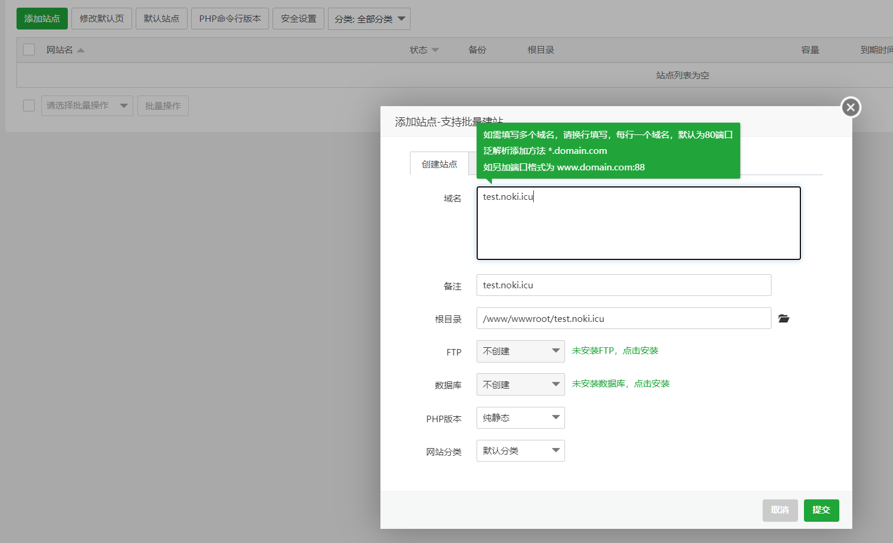
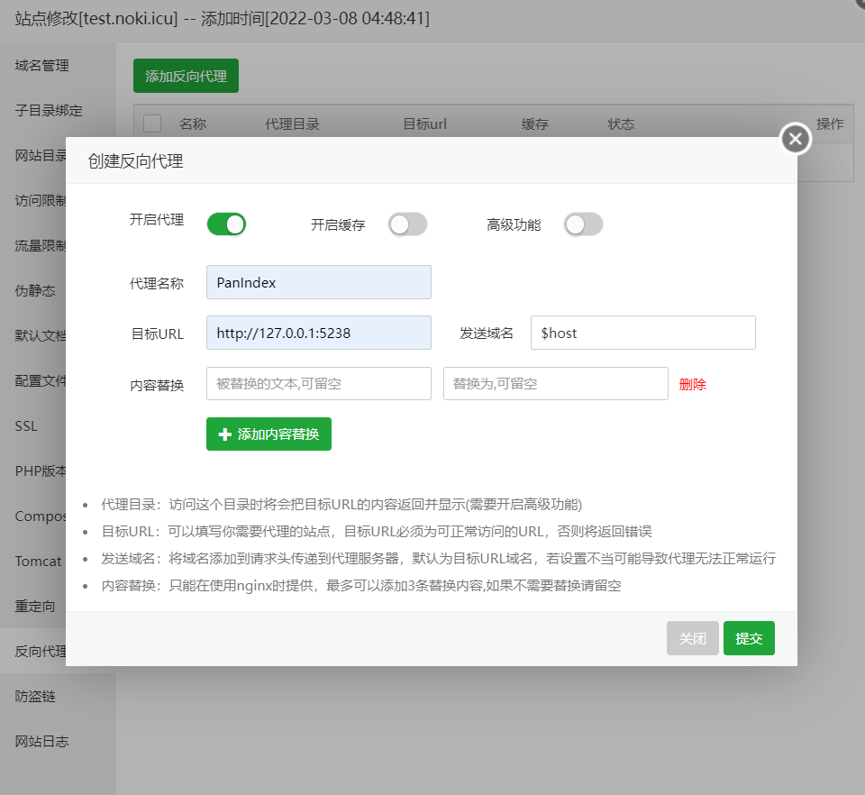
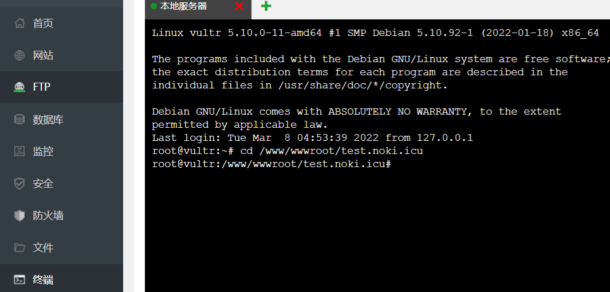
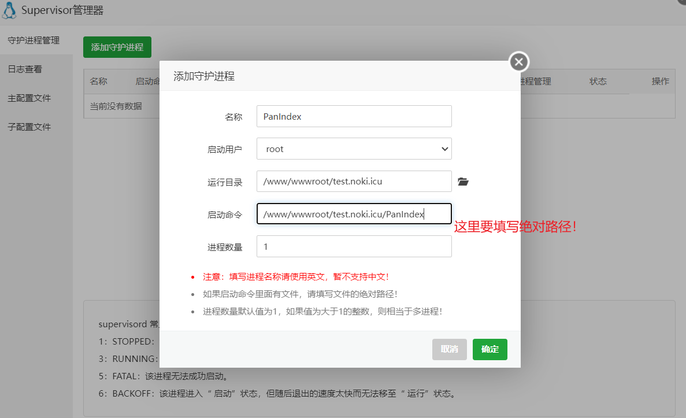
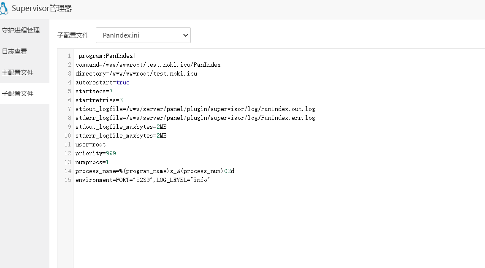

# 快速开始
## 平台支持
由于PanIndex交叉编译需要cgo（sqlite），目前很多平台还不能很好的支持，如果你有特殊的编译需求，请告知我，我会尽量添加
- Linux （musl / x86 / amd64 / arm / arm64 ）
- Windows 8 及之后版本（x86 / amd64 ）
- Darwin（amd64）

## 下载
预编译的二进制文件压缩包可在 [Github Release](https://github.com/libsgh/PanIndex/releases "release")下载，解压后方可使用。

基于开发分支的自动构建版本：[Nightly Build](https://nightly.link/libsgh/PanIndex/workflows/nightly-build/dev "build")，仅构建部分平台

## 安装

### Bash脚本
- 基于`systemd`的安装脚本，以`root`账户运行
- 脚本仓库：https://github.com/libsgh/PanIndex-install
```bash
$ bash <(curl -L https://github.com/libsgh/PanIndex-install/raw/main/install-release.sh) -h
```

### 直接运行
启动参数<br>
-c=config.json #指定启动的配置文件（3.x）
```json
{
  "host": "0.0.0.0",
  "port": 5238,
  "log_level": "info",
  "data_path": "",
  "cert_file": "",
  "key_file": "",
  "config_query": "",
  "db_type": "",
  "dsn": "",
  "ui": ""
}
```
`-host=0.0.0.0` #绑定host，默认0.0.0.0<br>
`-port=5238` #绑定端口号，默认5238<br>
`-log_level=info` #日志级别，默认info，设置为debug将输出更多信息<br>
`-data_path=/path/to/data` #数据目录（配置、目录信息、临时文件目录）<br>
`-cert_file=/path/to/fullchain.pem` # 开启ssl，证书文件<br>
`-key_file=/path/to/privkey.pem` # 开启ssl，证书文件密钥<br>
`-config_query=port` # 查询配置（新版），程序并不会启动<br>
`-cq=port` # 查询配置（旧版），程序并不会启动<br>
`-db_type=sqlite` # 数据源：sqlite(默认)、mysql、postgres<br>
`-dsn=` # 数据源连接
`-ui=` # 自定义UI目录
```
# postgres
host=localhost user=postgres password=1234 dbname=pan-index port=5432 sslmode=disable TimeZone=Asia/Shanghai
# mysql
user:pass@tcp(127.0.0.1:3306)/dbname?charset=utf8mb4&parseTime=True&loc=Local
# sqlite
data.data.db
```
> 启动时若不指定配置文件，将使用默认配置。配置优先级：环境变量 > 命令参数 > 配置文件（config.json），所有参数名大写，就是环境变量的`KEY`


环境变量主要用于Docker部署。

| 变量名称      | 变量值               | 描述                              |
|-----------|-------------------|---------------------------------|
| HOST      | 0.0.0.0           | 绑定HOST                          |
| PORT      | 5238              | 启动端口号，由于Heroku端口号随机，并需要从此环境变量获取 |
| LOG_LEVEL | info              | 日志级别                            |
| DATA_PATH | /app/data         | 数据目录，主要存储配置文件，SQLITE数据库文件       |
| CERT_FILE | -                 | 证书文件                            |
| KEY_FILE  | -                 | 证书密钥                            |
| DB_TYPE   | sqlite            | 数据源类型                           |
| DSN       | /app/data/data.db | 数据源链接                           |
| UI         | 绝对路径，默认为空         | 自定义UI目录                         |


```bash
$ tar -xvf PanIndex-linux-amd64.tar.gz
#nohup ./PanIndex -host=0.0.0.0 -port=5238 > PanIndex.log &
#./PanIndex -cq port
$ nohup ./PanIndex > PanIndex.log &
```
### Systemd服务运行
> 以下命令请切换到root下执行

1. 下载PanIndex并解压
```bash
$ mkdir /usr/local/etc/PanIndex
$ cd /usr/local/etc/PanIndex
$ wget https://github.com/libsgh/PanIndex/releases/download/v3.0.4/PanIndex-linux-amd64.tar.gz
$ tar --no-same-owner -xvf PanIndex-linux-amd64.tar.gz
$ mv PanIndex-linux-amd64 PanIndex
$ cp PanIndex /usr/local/bin/
$ cat > "/usr/local/etc/PanIndex/config.json" << EOF
{
  "host": "0.0.0.0",
  "port": 5238,
  "log_level": "info",
  "data_path": "/usr/local/etc/PanIndex/data",
  "cert_file": "",
  "key_file": "",
  "config_query": "",
  "db_type": "sqlite",
  "dsn": "/usr/local/etc/PanIndex/data/data.db"
}
EOF
```
2. 编写PanIndex.service文件
```bash
$ vim /etc/systemd/system/PanIndex.service
```
3. service内容参考
```
[Unit]
Description=PanIndex Service
Documentation=https://libsgh.github.io/PanIndex/
After=network.target
[Service]
User=root
WorkingDirectory=/usr/local/etc/PanIndex
ExecStart=/usr/local/bin/PanIndex -c=/usr/local/etc/PanIndex/config.json
Restart=on-failure
RestartPreventExitStatus=23
LimitNPROC=10000
LimitNOFILE=1000000
[Install]
WantedBy=multi-user.target
```

4. Systemd常用命令
```bash
$ systemctl daemon-reload #PanIndex.service有修改重新加载
$ systemctl restart PanIndex #重启PanIndex
$ systemctl enable PanIndex #设置开机启动
$ systemctl disable PanIndex #关闭开机启动
$ systemctl status PanIndex #查询服务状态
$ journalctl -u PanIndex.service -f #滚动查看PanIndex日志
```

```
environment=a="1",b="2"
```
### 源码运行
- 安装git和golang
- 设置go环境变量`go env -w GO111MODULE=on`
- 如果是国内服务器，设置下代理`go env -w GOPROXY=https://goproxy.cn,direct`
```bash
$ git clone https://github.com/libsgh/PanIndex.git
$ cd PanIndex
$ nohup go run main.go > PanIndex.log &
```
也可以下载源码后自行编译成二进制程序再执行
以linux,amd64为例
```bash
$ CGO_ENABLED=1 GOOS=linux GOARCH=amd64 go build -o PanIndex
$ nohup ./PanIndex &
```
更多平台编译参考：[PanIndex-build-action](https://github.com/libsgh/PanIndex-build-action)

### Docker
参考下面命令，映射`/app/data`目录到宿主机避免重启docker数据丢失！
```bash
docker pull iicm/pan-index:latest
docker stop PanIndex
docker rm PanIndex
docker run -itd \
 --restart=always \
 --name PanIndex \
 -p 5238:5238 \
 -v /home/single/data/docker/data/PanIndex/data:/app/data \
 -e PORT="5238" \
 iicm/pan-index:latest
```

### 反向代理

- Nginx
   ```
   location / {
      proxy_set_header Host $host;
      proxy_set_header X-Real-IP $remote_addr;
      proxy_set_header X-Forwarded-For $proxy_add_x_forwarded_for;
      proxy_pass http://127.0.0.1:5238;
   }
   #server中增加配置
   absolute_redirect off;#绝对重定向开关
   location /file/ {
      proxy_set_header Host $host;
      proxy_set_header X-Real-IP $remote_addr;
      proxy_set_header X-Forwarded-For $proxy_add_x_forwarded_for;
      proxy_pass http://127.0.0.1:5238/;
   }
   ```
- Caddy
   ```
   :80 {
       reverse_proxy 127.0.0.1:5238
   }
   ```
- Apache
   ```
   <VirtualHost *:80>
       ServerName exmple.noki.icu
       ProxyRequests Off
       ProxyPreserveHost On
       <Proxy *>
           Order deny,allow
           Allow from all
       </Proxy>
       <Location />
          ProxyPass http://localhost:5238/
          ProxyPassReverse http://localhost:5238/
       </Location>
   </VirtualHost>
   ```

### 宝塔
1.  安装宝塔。

官网安装教程：https://www.bt.cn/bbs/thread-19376-1-1.html

我这里以Debian 11 x64为例

安装脚本

   ```bash
   # wget -O install.sh http://download.bt.cn/install/install-ubuntu_6.0.sh && bash install.sh
   ```

2. 登录面板，绑定账号。

3. PanIndex只需要安装nginx即可，其他套件请按需安装。

   

4. 安装Supervisor。

   

5. 添加一个站点，域名需要先在dns处解析。

   

6. 配置SSL（可选），证书需要在反向代理关闭的状态下申请。

   

7. 配置Nginx反向代理，PanIndex默认端口时5238。

   

8. 连接终端下载或上传PanIndex程序

   

   ```bash
   # cd /www/wwwroot/test.noki.icu
   # wget https://github.com/libsgh/PanIndex/releases/download/v3.0.4/PanIndex-linux-amd64.tar.gz
   # tar -zxvf PanIndex-linux-amd64.tar.gz
   # mv PanIndex-linux-amd64 PanIndex
   # 复制PanIndex文件路径
   ```

9. Supervisor添加守护进程。

   

   

10. 访问https://test.noki.icu/， 正常显示表示启动成功，到此已经可以正常使用。

11. 修改启动端口（或日志级别），修改后记得改下nginx代理。

在子配置文件中添加环境变量，修改后重启进程生效。

environment=PORT="5239",LOG_LEVEL="debug"



### 常见问题

- 部署后无法访问的问题排查步骤 
  PanIndex端口是否被占用 > 反向代理配置 > （非80，443端口）防火墙（服务器+三方服务）> 启动日志 > 程序是否与运行平台一致(一般使用linux-amd64)

## 其他平台部署

### Heroku(即将收费)
[](https://heroku.com/deploy?template=https://github.com/libsgh/PanIndex-h.git)

https://github.com/libsgh/PanIndex-h
### Railway
[](https://railway.app/new/template/RYVkB4?referralCode=W9nIBo)

https://github.com/libsgh/PanIndex-railway
### ~~Okteto~~
[](https://cloud.okteto.com/deploy?repository=https://github.com/libsgh/PanIndex-okteto&branch=main)
> 可能导致封号，暂时还不清楚封号原因，可能有人用PanIndex做违反用户协议的事情受到了牵连，如果你已经封号的话可以联系下客服，概率解封。

https://github.com/libsgh/PanIndex-okteto
### koyeb
> koyeb账号申请并不容易，需要联系官方的人手动给你审核，不然就是等几个月...koyeb还有个最大问题是：数据配置无法保留，会被重置，除非连接外部数据库。
基于以上，如果你仍想部署的话，直接使用Docker镜像配置好环境变量即可，不需要特殊部署脚本。

### fly.io

https://github.com/libsgh/PanIndex-fly